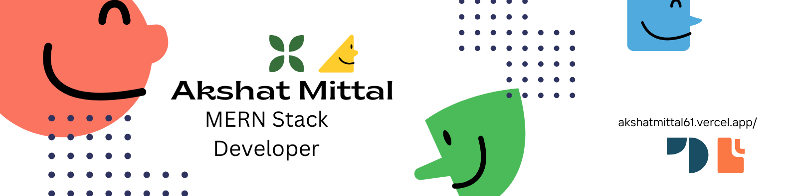

<h1> Hello Fellow < Developers />  </h1>

:smile:

<h2> About Me</h2>

-   🔭 I’m currently working on [Planner](https://github.com/akshatmittal61/planner), [Expenses Tracker](https://github.com/akshatmittal61/expenses-tracker), [Amigo](https://github.com/akshatmittal61/amigo), [Alumni Portal](https://github.com/akshatmittal61/alumni-portal-frontend)

-   🌱 I’m currently learning DSA, Full stack development

-   👯 I’m looking to collaborate on Open Source Projects, Tech Articles

-   💬 Talk to me about JavaScript, Freelancing Opportunites, Open Source, DSA

-   📝 I read articles on [dev.to](https://dev.to)

-   👨‍💻 Find my resume here: [My Resume](https://akshatmittal61.vercel.app/resume)

<h2> Skills  </h2>

<h2> Connect with me  </h2>

<h2> Stuff I work on   </h2>

 

<h2> My GitHub Stats  </h2>

<h2> Some Programming Humor for you </h2>

